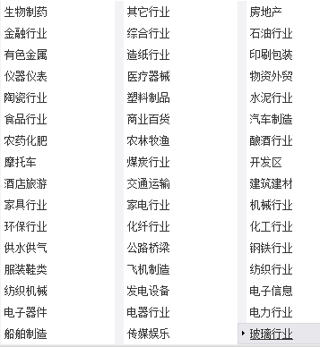

.. contents::
   :depth: 3.0
..

.. \_classifying:

.. currentmodule:: tushare

.. highlightlang:: python

股票分类数据
============

*分类数据*\ 提供股票的分类信息数据，从股票类型的不同角度进行数据分类，在一些统计套利方法的应用中，时常会以股票的分类来做切入，比如对某些行业或概念进行阶段统计来决定近期的交易策略等。TuShare提供的分类数据主要包括以下类别：

-  行业分类
-  概念分类
-  地域分类
-  中小板分类
-  创业板分类
-  风险警示板分类
-  沪深300成份股及权重
-  上证50成份股
-  中证500成份股
-  终止上市股票列表
-  暂停上市股票列表

行业分类
--------

在现实交易中，经常会按行业统计股票的涨跌幅或资金进出，本接口按照sina财经对沪深股票进行的行业分类，返回所有股票所属行业的信息。考虑到是一次性在线获取数据，调用接口时会有一定的延时，请在数据返回后自行将数据进行及时存储。sina财经提供的行业分类信息大致如下图所示：

返回值说明：

-  **code**\ ：股票代码
-  **name**\ ：股票名称
-  **c\_name**\ ：行业名称

调用方法：

::

    import tushare as ts

    ts.get_industry_classified()

结果显示：

::

            code    name      c_name
    0     600051    宁波联合   综合行业
    1     600209    罗顿发展   综合行业
    2     600212    江泉实业   综合行业
    3     600256    广汇能源   综合行业
    4     600603    大洲兴业   综合行业
    5     600614    鼎立股份   综合行业
    6     600620    天宸股份   综合行业
    7     600622    嘉宝集团   综合行业
    8     600624    复旦复华   综合行业
    9     600647    同达创业   综合行业
    10    600656    博元投资   综合行业

概念分类
--------

返回股票概念的分类数据，现实的二级市场交易中，经常会以"概念"来炒作，在数据分析过程中，可根据概念分类监测资金等信息的变动情况。本接口是一次性在线获取数据，调用接口时会有一定的延时，请在数据返回后自行将数据进行及时存储。sina财经提供的概念分类信息大致如下图所示：

.. figure:: _static/cpt.png
   :alt: 

返回值说明：

-  **code**\ ：股票代码
-  **name**\ ：股票名称
-  **c\_name**\ ：概念名称

调用方法：

::

    import tushare as ts

    ts.get_concept_classified()

结果显示：

::

          code     name      c_name
    0     600007   中国国贸   外资背景
    1     600114   东睦股份   外资背景
    2     600132   重庆啤酒   外资背景
    3     600182   S佳通     外资背景
    4     600595   中孚实业   外资背景
    5     600641   万业企业   外资背景
    6     600779   水井坊     外资背景
    7     600801   华新水泥   外资背景
    8     600819   耀皮玻璃   外资背景
    9     000001   平安银行   外资背景
    10    000005   世纪星源   外资背景

地域分类
--------

按地域对股票进行分类，即查找出哪些股票属于哪个省份。

参数说明：

-  **file\_path**:文件路径，默认为None即由TuShare提供，可以设定自己的股票文件路径。

返回值说明：

-  **code**\ ：股票代码
-  **name**\ ：股票名称
-  **area**\ ：地域名称

调用方法：

::

    import tushare as ts

    ts.get_area_classified()

结果显示：

::

          code     name     area
    0     000668   荣丰控股   上海
    1     002506   *ST超日   上海
    2     600597   光明乳业   上海
    3     603009   北特科技   上海
    4     002636   金安国纪   上海
    5     002346   柘中建设   上海
    6     300171    东富龙   上海
    7     600611   大众交通   上海
    8     600843   上工申贝   上海
    9     600490   鹏欣资源   上海
    10    601866   中海集运   上海

中小板分类
----------

获取中小板股票数据，即查找所有002开头的股票

参数说明：

-  **file\_path**:文件路径，默认为None即由TuShare提供，可以设定自己的股票文件路径。

返回值说明：

-  **code**\ ：股票代码
-  **name**\ ：股票名称

调用方法：

::

    import tushare as ts

    ts.get_sme_classified()

结果显示：

::

         code     name
    0    002001   新 和 成
    1    002002   鸿达兴业
    2    002003   伟星股份
    3    002004   华邦颖泰
    4    002005   德豪润达
    5    002006   *ST精功
    6    002007   华兰生物
    7    002008   大族激光
    8    002009   天奇股份
    9    002010   传化股份
    10   002011   盾安环境

创业板分类
----------

获取创业板股票数据，即查找所有300开头的股票

参数说明：

-  **file\_path**:文件路径，默认为None即由TuShare提供，可以设定自己的股票文件路径。

返回值说明：

-  **code**\ ：股票代码
-  **name**\ ：股票名称

调用方法：

::

    import tushare as ts

    ts.get_gem_classified()

结果显示：

::

         code    name
    0    300001  特锐德
    1    300002  神州泰岳
    2    300003  乐普医疗
    3    300004  南风股份
    4    300005  探路者
    5    300006  莱美药业
    6    300007  汉威电子
    7    300008  上海佳豪
    8    300009  安科生物
    9    300010  立思辰
    10   300011  鼎汉技术

风险警示板分类
--------------

获取风险警示板股票数据，即查找所有st股票

参数说明：

-  **file\_path**:文件路径，默认为None即由TuShare提供，可以设定自己的股票文件路径。

返回值说明：

-  **code**\ ：股票代码
-  **name**\ ：股票名称

调用方法：

::

    import tushare as ts

    ts.get_st_classified()

结果显示：

::

          code   name
    0   000033  *ST新都
    1   000403   ST生化
    2   000504  *ST传媒
    3   000520  *ST凤凰
    4   000557  *ST广夏
    5   000594  *ST国恒
    6   000659  *ST中富
    7   000677  *ST海龙
    8   000711  *ST京蓝
    9   000755  *ST三维
    10  000779  *ST派神

沪深300成份及权重
-----------------

获取沪深300当前成份股及所占权重

返回值说明：

-  **code** :股票代码
-  **name** :股票名称
-  **date** :日期
-  **weight**:权重

调用方法：

::

    import tushare as ts

    ts.get_hs300s()

结果显示：

::

         code     name       date       weight
    0    000001   平安银行  2015-03-02    0.93
    1    000002   万科Ａ    2015-03-02    1.43
    2    000009   中国宝安  2015-03-02    0.27
    3    000024   招商地产  2015-03-02    0.30
    4    000027   深圳能源  2015-03-02    0.10
    5    000039   中集集团  2015-03-02    0.20
    6    000060   中金岭南  2015-03-02    0.18
    7    000061   农 产 品  2015-03-02    0.21
    8    000063   中兴通讯  2015-03-02    0.46
    9    000069   华侨城Ａ  2015-03-02    0.33
    10   000100   TCL集团  2015-03-02    0.51

上证50成份股
------------

获取上证50成份股

返回值说明：

-  **code**\ ：股票代码
-  **name**\ ：股票名称

调用方法：

::

    import tushare as ts

    ts.get_sz50s()

结果显示：

::

        code    name
    0   600000  浦发银行
    1   600010  包钢股份
    2   600015  华夏银行
    3   600016  民生银行
    4   600018  上港集团
    5   600028  中国石化
    6   600030  中信证券
    7   600036  招商银行
    8   600048  保利地产
    9   600050  中国联通
    10  600089  特变电工

中证500成份股
-------------

获取中证500成份股

返回值说明：

-  **code**\ ：股票代码
-  **name**\ ：股票名称

调用方法：

::

    import tushare as ts

    ts.get_zz500s()

结果显示：

::

            code   name
    0    000006   深振业Ａ
    1    000012   南 玻Ａ
    2    000021   深科技
    3    000028   国药一致
    4    000030   富奥股份
    5    000031   中粮地产
    6    000049   德赛电池
    7    000050   深天马Ａ
    8    000062   深圳华强
    9    000066   长城电脑
    10   000078   海王生物

终止上市股票列表
----------------

获取已经被终止上市的股票列表，数据从上交所获取，目前只有在上海证券交易所交易被终止的股票。

返回值说明：

-  **code**\ ：股票代码
-  **name**\ ：股票名称
-  **oDate**:上市日期
-  **tDate**:终止上市日期

调用方法：

::

    import tushare as ts

    ts.get_terminated()

结果显示：

::

        code        name       oDate       tDate
    0   900949    东电B股  1997-09-22  2013-11-07
    1   600253    天方药业  2000-12-27  2013-07-15
    2   600991    广汽长丰  2004-06-14  2012-03-20
    3   600263    路桥建设  2000-07-25  2012-03-01
    4   600102    莱钢股份  1997-08-28  2012-02-28
    5   600631    百联股份  1993-02-26  2011-08-23
    6   600553    太行水泥  2002-08-22  2011-02-18
    7   600003   ST东北高  1999-08-10  2010-02-26
    8   600842    中西药业  1994-03-11  2010-02-12
    9   600607    上实医药  1992-03-27  2010-02-12

暂停上市股票列表
----------------

获取被暂停上市的股票列表，数据从上交所获取，目前只有在上海证券交易所交易被终止的股票。

返回值说明：

-  **code**\ ：股票代码
-  **name**\ ：股票名称
-  **oDate**:上市日期
-  **tDate**:暂停上市日期

调用方法：

::

    import tushare as ts

    ts.get_suspended()

结果显示：

::

        code   name       oDate     tDate
    0  601268  *ST二重  2010-02-02   -
