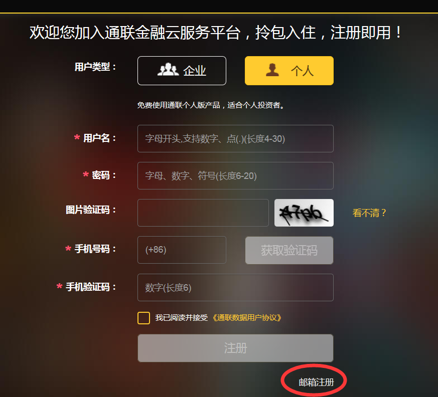
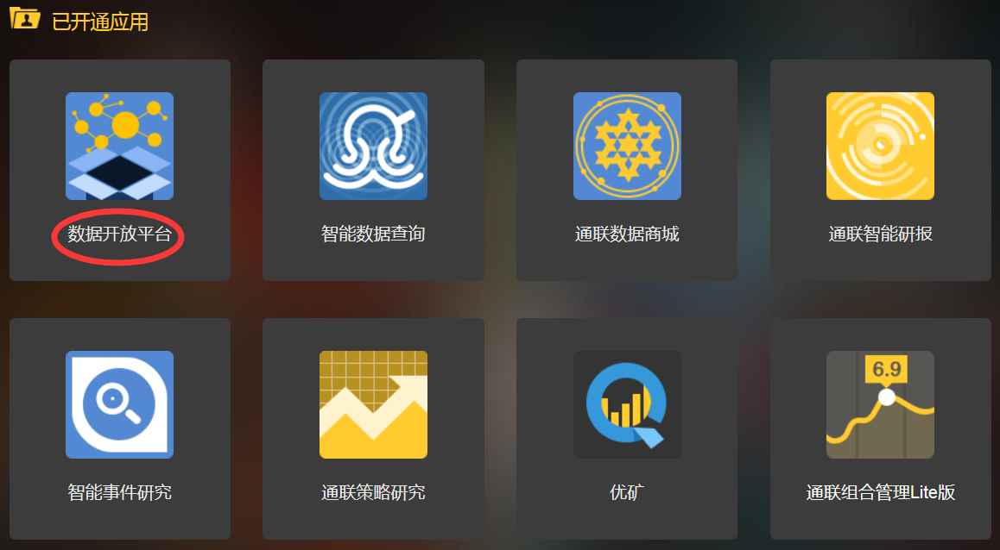
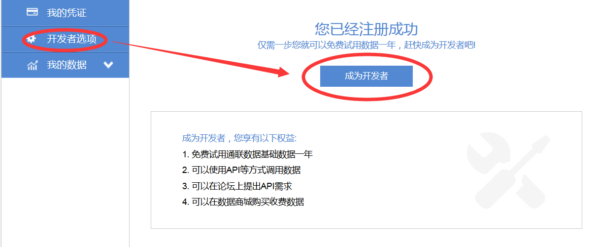
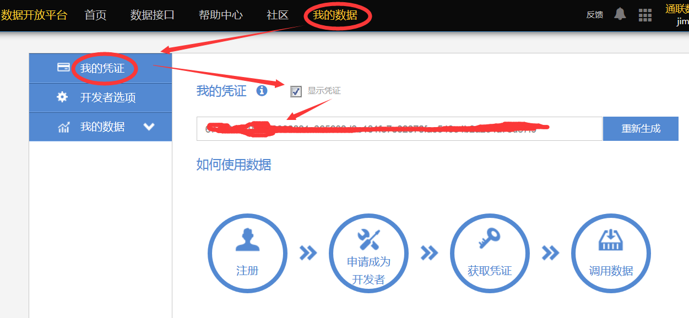
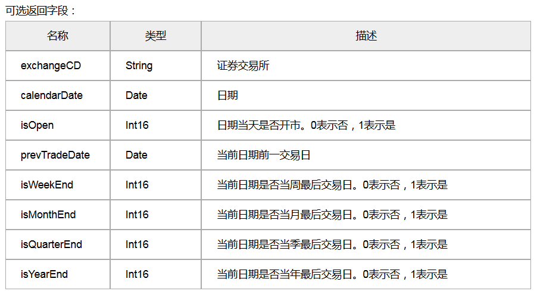
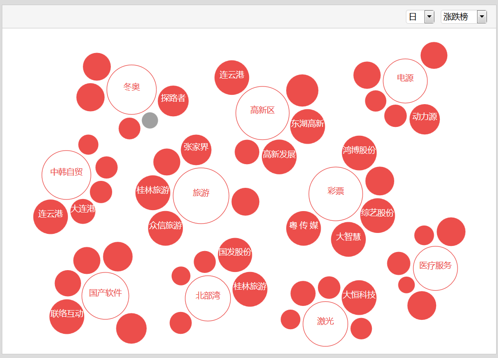

.. contents::
   :depth: 3.0
..

.. \_datayes:

.. currentmodule:: tushare

.. highlightlang:: python

通联数据
========

通联数据（DataYes）是国内目前最大的开放金融数据平台，整合了包括股票、基金、期货、期权和港股方面的全品类金融数据。从数据的多样性、质量性和稳定性的角度考虑，遵从TuShare一贯的开放、简单易用的特点，TuShare为用户集成了绝大部分通联数据的接口。虽然通联数据大部分数据接口都是免费使用，但毕竟是一家商业公司，使用前提是需要注册通联数据的用户账号，当然，注册过程还是相当简单的。

为了让TuShare用户更好的使用通联数据接口，请大家按以下步骤注册和操作，以便能顺利调用通联数据接口，用户注册必须从以下TuShare网站提供的链接进入注册环节，否则将不提供技术支持和服务。

另外，为了更好地提供服务以及方便用户进行接口使用经验交流，专门申请了通联数据的QQ服务群：488918622，请注册好通联数据账号后，将用户名作为QQ群的入群验证码发送进来方可加群，QQ群将不定期给符合要求的用户开通长期使用权限。

用户注册
--------

打开\ `通联数据 <http://router.wmcloud.com/6>`__\ 首页(http://router.wmcloud.com/6)，并点击“注册”按钮，进入用户注册界面：

选择“个人”，进入用户信息界面填写个人信息，为了在QQ群里能迅速定位个人的问题，强烈建议您用qq邮箱注册通联数据的账号：

通过邮箱注册账号，会收到验证邮件，通过点击邮件里的链接，设置通联数据的账号密码完成注册。

获取token
---------

登录通联数据账户，进入应用列表界面，点击“数据开放平台”，进入开放平台首页：

点击“我的数据”->“开发者选项”->“成为开发者”：

然后，点击“我的凭证”->“显示凭证”，看到token字符串之后拷贝，之后会在接口调用的时候使用。

调用方法
--------

在安装TuShare后，或者在调用通联数据接口前，需要先设置通联数据账户的token凭证码（只需设置一次，如果重新生成token，需要在TuShare里重新设置token码），方法如下：

::

    import tushare as ts
    ts.set_token('xxxxxxxxxxxxxxxxxxxxxxxxxxxx')

查看自己的token码，方法如下：

::

    ts.get_token()

获取某一类数据： mkt = ts.Market() df =
mkt.TickRTSnapshot(securityID='000001.XSHE')

证券概况
--------

可以查询机构ID编码，证券ID编码，证券上市信息，证券板块分类以及交易所交易日历等信息。所有证券概况的方法都在Master()类里，可以查询到以下数据：

-  SecID--证券编码及基本上市信息
-  TradeCal --交易所交易日历
-  Industry --行业分类标准
-  EquInfo --沪深股票键盘精灵
-  SecTypeRegionRel --沪深股票地域分类
-  SecTypeRegion --地域分类
-  SecTypeRel --证券板块成分
-  SecType --证券板块
-  SysCode --参数常量值集合

具体的调用参数和返回的field字段可以通过查看文档自行设定，文档地址：
https://app.wmcloud.com/open/api?lang=zh

调用样例：

::

    #获取一段时间内的日期是否为交易日，isOpen=1是交易日，isOpen=0为休市
    mt = ts.Master()
    df = mt.TradeCal(exchangeCD='XSHG', beginDate='20150928', endDate='20151010', field='calendarDate,isOpen,prevTradeDate')

返回结果：

::

       calendarDate  isOpen prevTradeDate
    0    2015-09-28       1    2015-09-25
    1    2015-09-29       1    2015-09-28
    2    2015-09-30       1    2015-09-29
    3    2015-10-01       0    2015-09-30
    4    2015-10-02       0    2015-09-30
    5    2015-10-03       0    2015-09-30
    6    2015-10-04       0    2015-09-30
    7    2015-10-05       0    2015-09-30
    8    2015-10-06       0    2015-09-30
    9    2015-10-07       0    2015-09-30
    10   2015-10-08       1    2015-09-30
    11   2015-10-09       1    2015-10-08
    12   2015-10-10       0    2015-10-09

通过查看通联数据的文档，可以获取以下详细信息，根据自己的实际需要来设定：

行情数据
--------

市场行情数据API提供实时市场行情数据快照，当天市场行情数据分钟线，历史日线数据和历史市场高频数据（level1)。
证券种类涵盖股票，指数，债券，基金；数据涵盖在上证（XSHG）和深圳（XSHE）交易的证券以及港股（XHKG）证券，港股目前仅支持一档行情。所有行情数据的方法都在Market()类里。

-  TickRTSnapshot --获取最新市场信息快照
-  TickRTSnapshotIndex --获取指数成份股的最新市场信息快照
-  IndustryTickRTSnapshot --获取行业资金流向
-  FutureTickRTSnapshot --获取期货最新市场信息快照
-  OptionTickRTSnapshot --获取期权最新市场信息快照
-  SecTips --沪深股票今日停复牌
-  EquRTRank --获取沪深股票涨跌幅排行
-  TickRTIntraDay --获取一只股票,指数,债券,基金在当日内时间段Level1信息
-  BarRTIntraDay --获取当日分钟线
-  BarRTIntraDayOneMinute --获取所有股票某一分钟的分钟线
-  FutureBarRTIntraDay --获取当日期货分钟线
-  FutureTickRTIntraDay --获取一只期货在本清算日内某时间段的行情信息
-  MktEqud --沪深股票日线行情
-  MktEqudAdj --沪深股票复权行情
-  MktAdjf --沪深股票复权因子
-  MktFutd --期货日线行情
-  MktMFutd --期货主力、连续合约日行情
-  MktIdxd --指数日线行情
-  MktOptd --期权日行情
-  MktBlockd --沪深大宗交易
-  MktBondd --债券日行情
-  MktRepod --债券回购交易日行情
-  MktHKEqud --港股日线行情
-  MktFundd–基金日行情
-  MktFunddAdjAf--基金后复权行情
-  MktFutMTR--期货会员成交量日排名
-  MktFutMSR--期货会员空头持仓日排名
-  MktFutMLR–期货会员多头持仓日排名
-  StockFactorsOneDay --获取多只股票历史上某一天的因子数据
-  StockFactorsDateRange --获取一只股票历史上某一时间段的因子数据

调用方法示例：

::

    #获取历史某一日股票行情数据，包括了停牌股票（停牌的报价都是0）
    st = ts.Market()
    df = st.MktEqud(tradeDate='20150917', field='ticker,secShortName,preClosePrice,openPrice,highestPrice,lowestPrice,closePrice,turnoverVol,turnoverRate')
    df['ticker'] = df['ticker'].map(lambda x: str(x).zfill(6))

返回结果：

::

          ticker secShortName   preClosePrice  openPrice  highestPrice  \
    0     000001         平安银行         10.900     10.850        11.140   
    1     000002          万科A         13.430     13.350        13.390   
    2     000004         国农科技         26.500     26.260        27.350   
    3     000005         世纪星源          6.630      6.600         7.090   
    4     000006         深振业A          9.540      9.580        10.490   
    5     000007         零七股份         29.170      0.000         0.000   
    6     000008         神州高铁         24.600     24.010        27.050   
    7     000009         中国宝安          9.910      9.910        10.540   
    8     000010          深华新          6.340      6.380         6.700   
    9     000011         深物业A         10.550     10.500        11.610   
    10    000012          南玻A          8.330      8.290         8.560  

            lowestPrice  closePrice  turnoverVol  turnoverRate  
    0          10.770      10.770     62079854        0.0053  
    1          13.100      13.100     61252961        0.0063  
    2          25.030      25.330      5496712        0.0655  
    3           6.200       6.300     51033136        0.0559  
    4           9.400       9.650     61232037        0.0456  
    5           0.000      29.170            0        0.0000  
    6          23.300      24.990     12354361        0.0578  
    7           9.800       9.910     81796088        0.0549  
    8           6.140       6.150     20251766        0.0565  
    9          10.360      10.830     37026937        0.2105  
    10          8.050       8.050     19792960        0.0152

其它内容信息请查看通联数据的文档。

基本面数据
----------

可以查询沪深上市公司披露的2007年以来的所有三大财务报表数据，以及业绩预告和快报数据信息。所有基本面方法都在Fundamental()类里。

-  FdmtBS--合并资产负债表
-  FdmtBSBank--银行业资产负债表
-  FdmtBSSecu--证券业资产负债表
-  FdmtBSIndu--一般工商业资产负债表
-  FdmtBSInsu--保险业资产负债表
-  FdmtCF--合并现金流量表
-  FdmtCFBank--银行业现金流量表
-  FdmtCFSecu--证券业现金流量表
-  FdmtCFIndu--一般工商业现金流量表
-  FdmtCFInsu--保险业现金流量表
-  FdmtIS--合并利润表
-  FdmtISBank--银行业利润表
-  FdmtISSecu--证券业利润表
-  FdmtISIndu--一般工商业利润表
-  FdmtISInsu--保险业利润表
-  FdmtEe--业绩快报
-  FdmtEf--业绩预告

调用示例：

::

    bd = ts.Fundamental()
    df = bd.FdmtBS(ticker='600848', field='ticker,TCA,fixedAssets,inventories,intanAssets') 

返回结果：

::

        ticker           TCA   fixedAssets   inventories  intanAssets  
    0   600848  9.993652e+08  2.512698e+08  2.161982e+08  25386816.40   
    1   600848  9.473522e+08  2.542558e+08  2.141980e+08  25757951.69   
    2   600848  9.266374e+08  2.540905e+08  1.895277e+08  26082865.49   
    3   600848  9.266374e+08  2.540905e+08  1.895277e+08  26082865.49   
    4   600848  9.266374e+08  2.540905e+08  1.895277e+08  26082865.49   
    5   600848  1.112599e+09  2.563483e+08  2.229435e+08  25452652.55   
    6   600848  1.116148e+09  2.616375e+08  2.294174e+08  25340796.32   
    7   600848  1.121110e+09  2.613411e+08  2.404694e+08  25645069.46   
    8   600848  1.079947e+09  2.598095e+08  2.086598e+08  25949342.60   
    9   600848  1.079947e+09  2.598095e+08  2.086598e+08  25949342.60   
    10  600848  1.079947e+09  2.598095e+08  2.086598e+08  25949342.60   
    11  600848  1.079947e+09  2.598095e+08  2.086598e+08  25949342.60 

其它内容信息请查看通联数据的文档。

股票信息
--------

可以查询沪深股票的基本信息和IPO，配股，分红，拆股，股改，行业，以及回报率等信息，所有股票信息的获取方法在Equity()类里。

-  Equ--股票基本信息
-  EquAllot--股票配股信息
-  EquDiv--股票分红信息
-  EquIndustry--股票行业分类
-  EquIPO--股票首次上市信息
-  EquRef--股票股权分置
-  EquRetud--股票每日回报率
-  EquSplits–股票拆股信息
-  FstTotal–沪深融资融券每日汇总信息
-  FstDetail–沪深融资融券每日交易明细信息
-  EquShare --公司股本变动
-  SecST --沪深股票ST标记

示例代码：

::

    #获取沪深A股正常股票信息，listStatusCD上市状态，可选状态有L——上市，S——暂停，DE——已退市，UN——未上市
    eq = ts.Equity()
    df = eq.Equ(equTypeCD='A', listStatusCD='L', field='ticker,secShortName,totalShares,nonrestFloatShares')
    df['ticker'] = df['ticker'].map(lambda x: str(x).zfill(6))

返回结果：

::

        ticker  secShortName  totalShares   nonrestFloatShares
    0     000001         平安银行  14308676139         11804054579
    1     000002          万科A  11048058100         11032671101
    2     000004         国农科技     83976684            83875459
    3     000005         世纪星源    914333607           913743007
    4     000006         深振业A   1349995046          1341487400
    5     000007         零七股份    230965363           205887138
    6     000008         神州高铁    803144309           213594042
    7     000009         中国宝安   1592107386          1489669062
    8     000010          深华新    588069788           358157448
    9     000011         深物业A    595979092           243467869
    10    000012          南玻A   2075335560          2065025819

其它内容信息请查看通联数据的文档。

港股信息
--------

可以查询香港交易所股票基本信息和上市公司行为等信息，所有港股信息的获取方法均在HKequity()类里。

-  HKEqu --港股基本信息
-  HKEquCA --港股公司行为

示例代码：

::

    #获取港股信息
    hk = ts.HKequity()
    df = hk.HKEqu(listStatusCD='L', field='secShortName,listDate,tradingUnit,partyID')
    df = df.sort('listDate', ascending=False)

返回结果：

::

                secShortName    listDate  tradingUnit   partyID
    837             中国顺客隆  2015-09-10         1000      5616
    1233             良斯集团  2015-09-08         4000      5538
    1197           前进控股集团  2015-09-02        10000      5535
    1241           宏基集团控股  2015-08-11         5000    829623
    1805           柏荣集团控股  2015-08-10        10000    226483
    1559             中国通号  2015-08-07         1000     88867
    1608              金嗓子  2015-07-15          500    163796
    1527             中智药业  2015-07-13         1000    526347
    1628             吉辉控股  2015-07-10         5000    788453
    1817           中国育儿网络  2015-07-08         2000    442617
    1446             环球医疗  2015-07-08          500    329752
    1196             培力控股  2015-07-08          500    500223

其它内容信息请查看通联数据的文档。

基金信息
--------

可以查询基金基本信息和资产配置，每日净值，收益情况，净值调整等信息，所有基金信息的获取方法均在Fund()类里。

-  Fund--基金基本信息
-  FundNav--基金历史净值(货币型,短期理财债券型除外)
-  FundDivm--基金历史收益(货币型,短期理财债券型)
-  FundDiv--基金净值调整
-  FundAssets--基金资产配置
-  FundHoldings--基金持仓明细
-  FundETFPRList–ETF基金申赎清单基本信息
-  FundETFCons–ETF基金申赎清单成分券信息
-  MktFutMLR–基金评级
-  FundSharesChg–基金份额变动
-  FundLeverageInfo--分级基金基本信息

示例代码：

::

    #获取基金的净值调整信息，包括基金分红和基金拆分两种调整情况
    fd = ts.Fund()
    df = fd.FundDiv(ticker='184688', adjustedType='D',beginDate='20000101', field='secShortName,effectDate,publishDate,dividendAfTax,dividendBfTax')

返回结果：

::

            secShortName  effectDate publishDate  dividendAfTax  dividendBfTax
    0        南方开元封闭  2000-04-04  2000-03-28          0.275          0.275
    1        南方开元封闭  2001-04-05  2001-03-30          0.530          0.530
    2        南方开元封闭  2002-04-05  2002-03-29          0.014          0.014
    3        南方开元封闭  2004-06-30  2004-06-24          0.060          0.060
    4        南方开元封闭  2006-04-05  2006-03-29          0.030          0.030
    5        南方开元封闭  2007-04-02  2007-03-27          0.500          0.500
    6        南方开元封闭  2007-04-25  2007-04-18          0.100          0.100
    7        南方开元封闭  2007-07-25  2007-07-11          0.420          0.420
    8        南方开元封闭  2007-11-02  2007-10-25          0.300          0.300
    9        南方开元封闭  2008-04-11  2008-03-29          1.372          1.372
    10       南方开元封闭  2010-04-14  2010-04-03          0.050          0.050

其它内容信息请查看通联数据的文档。

期货信息
--------

可以查询中国四大期货交易所期货合约的基本要素信息和和国债期货的转换因子信息

-  Futu--期货合约信息
-  FutuConvf--国债期货转换因子信息

示例代码：

::

    fd = ts.Future()
    df = fd.Futu(exchangeCD='CCFX', field='secShortName,contractObject,minChgPriceNum,lastTradeDate,deliMethod')

返回结果：

::

         secShortName           contractObject  minChgPriceNum lastTradeDate deliMethod
    0    中证500股指期货1505             IC           0.200    2015-05-15          C
    1    中证500股指期货1506             IC           0.200    2015-06-19          C
    2    中证500股指期货1507             IC           0.200    2015-07-17          C
    3    中证500股指期货1508             IC           0.200    2015-08-21          C
    4    中证500股指期货1509             IC           0.200    2015-09-18          C
    5    中证500股指期货1510             IC           0.200    2015-10-16          C
    6    中证500股指期货1511            NaN           0.200    2015-11-20        NaN
    7    中证500股指期货1512             IC           0.200    2015-12-18          C
    8    中证500股指期货1603             IC           0.200    2016-03-18          C
    9    沪深300股指期货1005             IF             NaN    2010-05-21        NaN
    10   沪深300股指期货1006             IF             NaN    2010-06-18        NaN
    11   沪深300股指期货1007             IF             NaN    2010-07-16        NaN

其它内容信息请查看通联数据的文档。

期权信息
--------

可以查询期权合约的基本信息、每日盘前静态数据和期权标的物信息

-  Opt --期权基本信息
-  OptVar --期权品种信息

示例代码：

::

    ＃获取期权合约编码，交易代码，交易市场，标的等相关信息
    fd = ts.Options()
    df = fd.Opt(contractStatus='L,DE', field='optID,secShortName,varShortName,listDate')

返回结果：

::

            optID   secShortName    　varShortName    listDate
    0    10000001   50ETF购3月2200    华夏上证50ETF  2015-02-09
    1    10000002   50ETF购3月2250    华夏上证50ETF  2015-02-09
    2    10000003   50ETF购3月2300    华夏上证50ETF  2015-02-09
    3    10000004   50ETF购3月2350    华夏上证50ETF  2015-02-09
    4    10000005   50ETF购3月2400    华夏上证50ETF  2015-02-09
    5    10000006   50ETF沽3月2200    华夏上证50ETF  2015-02-09
    6    10000007   50ETF沽3月2250    华夏上证50ETF  2015-02-09
    7    10000008   50ETF沽3月2300    华夏上证50ETF  2015-02-09
    8    10000009   50ETF沽3月2350    华夏上证50ETF  2015-02-09
    9    10000010   50ETF沽3月2400    华夏上证50ETF  2015-02-09

其它内容信息请查看通联数据的文档。

期权隐含波动率
--------------

IVolatility是全球领先的期权数据及分析服务提供商。公司总部位于纽约。15年来，公司致力于采集各国期权信息，并在数据基础上，为不同专业程度的投资者（从初级投资者到对冲基金的专业投资人士）提供分析工具以获取投资优势。
IVolatility的客户遍布全球，包括对冲基金和各类机构（交易所、经纪公司、银行、教育机构等）
。例如，公司和美国芝加哥期权交易所（CBOE）联合开发了期权分析工具。
2015年8月，IVolatility
与通联数据合作，为中国市场开发了隐含波动率产品（implied
volatilities）。本产品目前涵盖了2015年2月挂牌上市的上证ETF50期权，并将持续更新新上市的期权产品。

-  DerIv --原始隐含波动率
-  DerIvHv --历史波动率
-  DerIvIndex --隐含波动率指数
-  DerIvIvpDelta --隐含波动率曲面(基于参数平滑曲线)
-  DerIvParam --隐含波动率参数化曲面
-  DerIvRawDelta --隐含波动率曲面(基于原始隐含波动率)
-  DerIvSurface --隐含波动率曲面(在值程度)

示例代码：

::

    ＃原始隐含波动率
    iv = ts.IV()
    df = iv.DerIv(beginDate='20150810', endDate='20150810', SecID='510050.XSHG')

返回结果：

::

               SecID  ticker exchangeCD secShortName   tradeDate  closePriceAdj  \
    0    510050.XSHG  510050       XSHG    华夏上证50ETF  2015-08-10          2.616   
    1    510050.XSHG  510050       XSHG    华夏上证50ETF  2015-08-10          2.616   
    2    510050.XSHG  510050       XSHG    华夏上证50ETF  2015-08-10          2.616   
    3    510050.XSHG  510050       XSHG    华夏上证50ETF  2015-08-10          2.616   
    4    510050.XSHG  510050       XSHG    华夏上证50ETF  2015-08-10          2.616   
    5    510050.XSHG  510050       XSHG    华夏上证50ETF  2015-08-10          2.616   
    6    510050.XSHG  510050       XSHG    华夏上证50ETF  2015-08-10          2.616   
    7    510050.XSHG  510050       XSHG    华夏上证50ETF  2015-08-10          2.616   
    8    510050.XSHG  510050       XSHG    华夏上证50ETF  2015-08-10          2.616   
    9    510050.XSHG  510050       XSHG    华夏上证50ETF  2015-08-10          2.616   
    10   510050.XSHG  510050       XSHG    华夏上证50ETF  2015-08-10          2.616  

以上类别数据为收费数据，请到通联数据官网购买：https://app.wmcloud.com/datamkt/search?vendorId=19&lang=zh

其它内容信息请查看通联数据的文档。

债券信息
--------

可以查询债券基本信息和发行上市，付息，利率，评级和评级变动，债券发行人评级及变动，担保人评级及变动等信息,所有债券信息获取方法都在Bond()类里。

-  Bond--债券基本信息
-  BondAi--债券应计利息
-  BondCf--债券付息兑付数据
-  BondCoupon--债券票面利率
-  BondGuar--债券担保
-  BondIssue--债券发行信息
-  BondOption--债券选择权
-  BondRating--债券评级
-  GuarRating--债券担保人信用评级
-  IssuerRating--债券发行人信用评级
-  Repo --债券回购基本信息

示例代码：

::

    #固定利率债券、浮动利率债券每个计息周期的票面利率，包括分段计息的具体利率。
    fd = ts.Bond()
    df = fd.BondCoupon(ticker='000001', field='secShortName,perValueDate,refRatePer,coupon')

返回结果：

::

        secShortName perValueDate  refRatePer  coupon
    0       00国债01   2000-02-24        2.25    2.90
    1       00国债01   2001-02-24        2.25    2.90
    2       00国债01   2002-02-24        1.98    2.63
    3       00国债01   2003-02-24        1.98    2.63
    4       00国债01   2004-02-24        1.98    2.63
    5       00国债01   2005-02-24        2.25    2.90
    6       00国债01   2006-02-24        2.25    2.90

其它内容信息请查看通联数据的文档。

指数信息
--------

可以查询指数基本要素信息和成分构成情况，国内外指数的成分股权重情况，中证指数除数信息和其发布的指数成分股的自由流通股和权重信息

-  Idx--指数基本信息
-  IdxCons--指数成分构成

示例代码：

::

    #获取国内外指数的成分构成情况，包括指数成份股名称、成份股代码、入选日期、剔除日期等。
    fd = ts.Idx()
    df = fd.IdxCons(ticker='000001', field='secShortName,consTickerSymbol,consShortName,isNew,intoDate')

返回结果：

::

            secShortName  consTickerSymbol      consShortName  isNew    intoDate
    1113         上证综指            603838          四通股份      1  2015-07-15
    1110         上证综指            603979           金诚信      1  2015-07-14
    1112         上证综指            603223          恒通股份      1  2015-07-14
    1111         上证综指            603085          天成自控      1  2015-07-14
    1107         上证综指            603117          万林股份      1  2015-07-13
    1109         上证综指            603116           红蜻蜓      1  2015-07-13
    1108         上证综指            603589           口子窖      1  2015-07-13
    1106         上证综指            601211          国泰君安      1  2015-07-10
    1105         上证综指            601368          绿城水务      1  2015-06-29
    1102         上证综指            603616          韩建河山      1  2015-06-26
    1104         上证综指            603066          音飞储存      1  2015-06-26
    1103         上证综指            601968          宝钢包装      1  2015-06-26
    1101         上证综指            601985          中国核电      1  2015-06-25

其它内容信息请查看通联数据的文档。

宏观行业
--------

获取宏观行业数据，所有宏观和行业数据均在Macro()类里。

-  ChinaDataGDP --GDP
-  ChinaDataECI --宏观数据经济景气指数
-  ChinaDataPMI --PMI
-  ChinaDataCCI --消费者景气指数
-  ChinaDataEconomistsBoomIndex --经济学家景气指数
-  ChinaDataIndustrialBusinessClimateIndex --工业企业景气指数
-  ChinaDataCPI --CPI
-  ChinaDataPPI --PPI
-  ChinaDataIndustry --工业
-  ChinaDataRetailSales --国内贸易
-  ChinaDataResidentIncomeExp --居民收支
-  ChinaDataFAI --固定资产投资
-  ChinaDataRealEstate --房地产开发
-  ChinaDataForeignTrade --进出口
-  ChinaDataFDI --外商直接投资
-  ChinaDataMoneyStatistics --货币统计
-  ChinaDataAllSystemFinancing --社会融资规模
-  ChinaDataLendingDeposit --金融机构存贷款
-  ChinaDataCreditFundsTable --金融机构信贷收支
-  ChinaDataOpenMarketOperation --人行公开市场回购
-  ChinaDataExchangeRate --汇率
-  ChinaDataInterestRateLendingDeposit --存贷款利率
-  ChinaDataInterestRateSHIBOR --Shibor
-  ChinaDataInterestRateInterbankRepo --银行间同业拆借
-  ChinaDataFinance --财政
-  ChinaDataGoldClosePrice --黄金收盘价

示例代码：

::

    #包含中国居民消费价格指数(CPI)数据，如大类CPI同比、环比、36大中城市CPI。历史数据从1993年开始，按月更新。
    fd = ts.Macro()
    df = fd.ChinaDataCPI(indicID='M030000003', field='indicName,periodDate,dataValue,dataSource')
    df = df.sort('periodDate', ascending=False)

返回结果：

::

              indicName                 periodDate  dataValue dataSource
    0    月_居民消费价格指数(CPI)_同比  2015-08-31   2.000000      国家统计局
    1    月_居民消费价格指数(CPI)_同比  2015-07-31   1.600000      国家统计局
    2    月_居民消费价格指数(CPI)_同比  2015-06-30   1.400000      国家统计局
    3    月_居民消费价格指数(CPI)_同比  2015-05-31   1.230767      国家统计局
    4    月_居民消费价格指数(CPI)_同比  2015-04-30   1.509062      国家统计局
    5    月_居民消费价格指数(CPI)_同比  2015-03-31   1.375778      国家统计局
    6    月_居民消费价格指数(CPI)_同比  2015-02-28   1.431120      国家统计局
    7    月_居民消费价格指数(CPI)_同比  2015-01-31   0.763809      国家统计局
    8    月_居民消费价格指数(CPI)_同比  2014-12-31   1.505570      国家统计局
    9    月_居民消费价格指数(CPI)_同比  2014-11-30   1.440000      国家统计局
    10   月_居民消费价格指数(CPI)_同比  2014-10-31   1.600000      国家统计局

其它内容信息请查看通联数据的文档。

特色大数据
----------

可以根据股票获取股票相关联的公司的新闻和公告数据，以及新闻公告摘要分类数据等。
还可以根据股票主题获取主题包含的股票和新闻。所有获取方法均在Subject()类里。

-  SocialDataXQ–雪球社交统计
-  SocialDataXQByTicker–雪球社交统计(单只证券)
-  SocialDataXQByDate–雪球社交统计(单个日期)
-  SocialDataGuba–获取证券的股吧社交热度
-  SocialThemeDataGuba–获取主题的股吧社交热度
-  NewsInfoByTime–获取一天某段时间内的新闻信息
-  NewsInfo–新闻信息
-  NewsContent–新闻信息(附全文及链接)
-  NewsContentByTime–获取一天某段时间内的新闻信息(附全文及链接)
-  CompanyByNews–获取新闻关联的公司(含新闻情感)
-  NewsByCompany–获取公司关联的新闻(含新闻情感)
-  NewsInfoByInsertTime–获取一天某段时间内入库的新闻信息
-  NewsContentByInsertTime–获取一天某段时间内入库的新闻信息(附全文及链接)
-  TickersByNews–获取新闻关联的证券(含新闻情感)
-  NewsByTickers–获取证券关联的新闻(含新闻情感)
-  NewsHeatIndex–新闻热度指数
-  NewsSentimentIndex–新闻情感指数
-  ReportByTicker–根据证券代码获取相应公告分类结果
-  ReportByCategory–根据公告分类获取相应公告信息
-  ReportContentByID–根据公告ID获取公告内容
-  ReportContent–获取公告相关的内容
-  ThemesContent--主题基本信息
-  TickersByThemes--获取主题关联的证券
-  ThemesTickersInsert--获取一段时间内主题新增的关联证券
-  ThemesTickersDelete--获取一段时间内主题删除的关联证券
-  ThemesByTickers--获取证券关联的主题
-  ThemesPeriod--获取主题活跃周期
-  ActiveThemes--获取某天的活跃主题
-  ThemesSimilarity--获取相似主题
-  ThemesHeat--主题热度
-  SectorThemesByTickers--获取证券关联的主题(源自行业)
-  WebThemesByTickers--获取证券关联的主题(源自网络)
-  ActiveThemesInsert--获取一段时间内新增的活跃主题
-  ActiveThemesDelete--获取一段时间内删除的活跃主题
-  ThemesCluster--当天活跃主题聚类对应关系
-  ThemesByNews--获取新闻关联的主题
-  ThemesByNewsCompanyRel--获取新闻关联的主题(仅含公司相关新闻)
-  ThemesInsertDB--获取一段时间内新入库的主题
-  ThemesByNewsLF--获取新闻关联的主题(优化后)
-  ThemesByNewsMF--获取新闻关联的主题(二次优化后)
-  ThemesByNewsTime--根据发布时间获取新闻关联的主题
-  ThemesByNewsTimeCompanyRel--根据发布时间获取新闻关联的主题(仅含公司相关新闻)
-  ThemesByNewsTimeLF--根据发布时间获取新闻关联的主题(优化后)
-  ThemesByNewsTimeMF--根据发布时间获取新闻关联的主题(二次优化后)
-  ThemesByNews2--获取新闻关联的主题2.0
-  ThemesByNewsTime2--根据发布时间获取新闻关联的主题2.0

示例代码：

::

    #包含所有主题基本信息。输入主题代码或名称、主题来源，可以获取主题相关信息，包括主题ID、主题名称、主题描述、主题来源、当天是否活跃、主题插入时间、主题更新时间等。(注：1、主题基期自2011/4/16始；2、数据按日更新主题活跃状态。)
    fd = ts.Subject()
    df = fd.ThemesContent(field='themeName,themeBaseDate,isActive,insertTime')
    df = df.sort('insertTime', ascending=False)

返回结果：

::

                themeName       themeBaseDate  isActive           insertTime
    5039            工程建设    2015-08-17         1  2015-09-16 09:00:15
    5044            超越平台    2015-08-17         0  2015-09-16 09:00:15
    5043           洛阳自贸区    2015-08-17         0  2015-09-16 09:00:15
    5042            台风环高    2015-08-17         1  2015-09-16 09:00:15
    5041              民生    2015-08-17         1  2015-09-16 09:00:15
    5040           上海旅游节    2015-08-17         1  2015-09-16 09:00:15
    5038          深圳国企改革    2015-08-17         0  2015-09-16 09:00:03
    5037          超跌国企改革    2015-08-17         0  2015-09-16 09:00:03
    5030            掘金受益    2015-08-11         1  2015-09-10 09:00:03
    5036           中阿博览会    2015-08-11         1  2015-09-10 09:00:03
    5035            福州新区    2015-08-11         1  2015-09-10 09:00:03

其它内容信息请查看通联数据的文档。

主题数据效果图：

