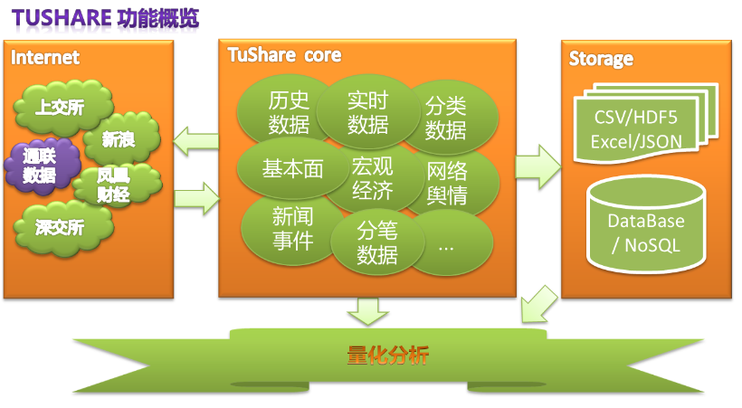

.. tushare documentation master file, created by Jimmy Liu

.. currentmodule:: tushare

.. highlightlang:: python

前言
====

**TuShare是一个免费、开源的python财经数据接口包。**\ 主要实现对股票等金融数据从\ **数据采集**\ 、\ **清洗加工**
到
**数据存储**\ 的过程，能够为金融分析人员提供快速、整洁、和多样的便于分析的数据，为他们在数据来源方面极大地减轻了工作量，使他们更加专注于策略和模型的研究与实现上。考虑到Python
pandas包在金融量化分析中体现出的优势，TuShare返回的绝大部分的数据格式都是pandas
DataFrame类型，非常便于用pandas/NumPy/Matplotlib进行数据分析和可视化。当然，如果您习惯了用Excel或者关系型数据库做分析，您也可以通过TuShare的数据存储功能，将数据全部保存到本地后进行分析。应一些用户的请求，从0.2.5版本开始，TuShare同时兼容Python
2.x和Python
3.x，对部分代码进行了重构，并优化了一些算法，确保数据获取的高效和稳定。

TuShare从发布到现在，已经帮助很多用户在数据方面降低了工作压力，同时也得到很多用户的反馈，TuShare将一如既往的用免费和开源的形式分享出来，希望对有需求的人带来一些帮助。如果您觉得TuShare好用并有所收获，请通过\ **微博**\ 、微信或者网站\ **博客**\ 的方式分享出去，让更多的人了解和使用它，使它能在大家的使用过程中逐步得到改进和提升。TuShare还在不断的完善和优化，后期将逐步增加港股、期货、外汇和基金方面的数据，所以，您的支持和肯定才是TuShare坚持下去的动力。

TuShare的数据主要来源于网络，如果在使用过程碰到数据无法获取或发生数据错误的情况，可以通过\ **Email:jimmysoa@sina.cn
QQ:52799046**
联系我，如果有什么好的建议和意见，也请及时联系我，在此谢过。如果在pandas/NumPy技术上有问题，欢迎加入“pandas数据分析”QQ群：297882961，我会和大家一起帮忙为您解决。

致谢
----

-  感谢\ `新浪财经 <http://finance.sina.com.cn/>`__\ 、\ `凤凰财经 <http://finance.ifeng.com/>`__\ 、上交所和深交所提供数据
-  感谢深圳大学经济学院研究生\ **邓志浩**\ 的测试和校对
-  感谢上海纽约大学波动研究所\ `赵志强 <http://www.zhihu.com/people/zhao-zhi-qiang-99>`__\ 的审阅
-  感谢在QQ、微博和Email里提出意见和建议的很多个不知道名字的朋友们

关于捐助
--------

在捐助的问题上，其实我一直是羞于启齿的。

从一开始在@vodkabuaa的“算法交易研究小组”群里就有人提出可以捐助一下TuShare，到后来一些用户在我的微博和QQ私底下交流中也提到这个问题，我都是诚恳的表达了谢意并没发布捐助计划。直到对TuShare进行Python2、Python3兼容性整合的时候，才发现原来工作量也是如此巨大，尤其在翻看以前的代码进行优化的时候，才想起了之前无数个深夜里台灯底下独自研究数据接口和敲写代码的时光（TuShare是业余完成），虽没有“为伊消得人憔悴”，却也放任了很多的宝贵睡眠时间。有时候，我自己也在怀疑到底能不能坚持写下去，还好，有很多用户通过加我的QQ或者微博表达了支持，有些甚至成为了好朋友。接下来，我会继续完善和提升TuShare的功能和性能，在使用教程和后期数据分析的demo方面，我个人已经申请了域名和虚拟主机，但由于服务器在美国，从国内访问速度方面有点差强人意，后期我会在国内申请相关服务，一方面提升访问速度增强用户体验，另外也想对一些特定的数据进行存储，方便大家获取。

那么，如果能得到您的支持，我将感激不尽，您的打赏将是对我从精神和物质方面的双重支持，对于您是否打赏，打赏多少，我没有要求也不会强迫，只有默默地等待。如果您伸出了援手，我会记下您的“善举”，有需要我帮忙的请随时找我，无论是编程语言、数据库、Python/pandas还是量化分析方面的问题，我会一一认真帮您解答。

**打赏方式一（微信）**\ ：

请通过微信“扫一扫”下面的二维码（或添加我的微信jimmysoa打赏个红包也OK）

.. figure:: _static/wx.jpg
   :alt: 

**打赏方式二（支付宝）**\ ：
请打开支付宝App“扫一扫”下面的二维码（或通过帐号liuzhiming@ymail.com）

再次表达作者的谢意！

使用对象
--------

-  量化投资分析师（Quant）
-  对金融市场进行大数据分析的企业和个人
-  开发以证券为基础的金融类产品和解决方案的公司
-  正在学习利用python进行数据分析的人

【注：最近有人问到说TuShare不方便看行情，我想说的是，TuShare不是普通炒股者用的软件，而是为那些有兴趣做股票期货数据分析的人提供pandas矩阵数据的工具，至于能不能用来炒股以及效果如何，就看个人的能力了】

使用前提
--------

-  安装Python
-  安装pandas

建议安装Anaconda（http://www.continuum.io/downloads），一次安装包括了全部依赖包，减少问题出现的几率。

下载安装
--------

-  方式1：pip install tushare
-  方式2：访问\ https://pypi.python.org/pypi/tushare/\ 下载安装
-  方式3：将源代码\ `下载到本地 <https://github.com/waditu/tushare>`__
   python setup.py install

版本升级
--------

-  pip install tushare --upgrade

查看当前版本的方法：

::

    import tushare

    print tushare.__version__

版本信息
--------

0.2.6 2015/04/22

-  新增沪市融资融券列表
-  新增沪市融资融券明细列表
-  新增深市融资融券列表
-  新增深市融资融券明细列表
-  修正复权数据数据源出现null造成异常问题（对大约300个股票有影响）

0.2.5 2015/04/16

-  完成python2.x和python3.x兼容性支持
-  部分算法优化和代码重构
-  新增中证500成份股
-  新增当日分笔交易明细
-  修正分配预案（高送转）bug

0.2.3 2015/04/11

-  新增“新浪股吧”消息和热度
-  新增新股上市数据
-  修正“基本面”模块中数据重复的问题
-  修正历史数据缺少一列column（数据来源问题）的bug

0.2.0 2015/03/17

-  新增历史复权数据接口
-  新增即时滚动新闻、信息地雷数据
-  新增沪深300指数成股份及动态权重、
-  新增上证50指数成份股
-  修改历史行情数据类型为float

0.1.9 2015/02/06

-  增加分类数据
-  增加数据存储示例

0.1.6 2015/01/27

-  增加了重点指数的历史和实时行情
-  更新docs

0.1.5 2015/01/26

-  增加基本面数据接口
-  发布一版使用手册，开通\ `TuShare
   docs <http://tushare.waditu.com>`__\ 网站

0.1.3 2015/01/13

-  增加实时交易数据的获取
-  Done for crawling Realtime Quotes data

0.1.1 2015/01/11

-  增加tick数据的获取

0.1.0 2014/12/01

-  创建第一个版本
-  实现个股历史数据的获取

--------------

.. toctree::
    :maxdepth: 2
    
    index
    trading
    reference
    classifying
    fundamental
    macro
    newsevent
    storing