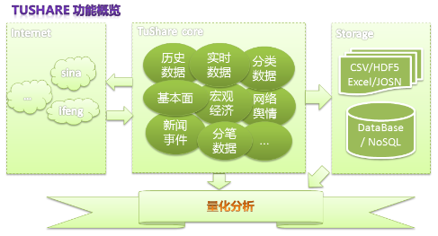

.. _preface:

.. currentmodule:: tushare

.. highlightlang:: python

前言
====

**TuShare是一个免费、开源的python财经数据接口包。**\ 主要实现对股票等金融数据从\ **数据采集**\ 、\ **清洗加工**
到
**数据存储**\ 的过程，能够为金融分析人员提供快速、整洁、和多样的便于分析的数据。考虑到python
pandas包在金融量化分析中体现出的优势，TuShare返回的绝大部分的数据格式都是pandas
DataFrame类型，非常便于用pandas/NumPy/Matplotlib进行数据分析和可视化。

TuShare的数据主要来源于新浪财经、凤凰财经等各大门户网站，如果在使用过程碰到数据源地址发生变更或者数据结构变化造成错误，请自行查找和修改，或者通过\ **Email:jimmysoa@sina.cn
QQ:52799046**
联系我，如果有什么好的建议和意见，也请及时联系我，在此谢过。

TuShare的产生完全是本人业余兴趣和学习新鲜事物的结果，以免费和开源的形式分享出来，希望对有需求的人有所帮助。如果您觉得TuShare好用，在\ `GitHub <https://github.com/waditu/tushare>`__\ 里对TuShare点一下\ **Star**\ 来就算是对她的支持，如果您也想参与其中，欢迎Fork和提交Pull
Requests.

感谢
----

-  感谢\ `新浪财经 <http://finance.sina.com.cn/>`__\ 、\ `凤凰财经 <http://finance.ifeng.com/>`__\ 提供数据
-  感谢深圳大学经济学院研究生\ **邓志浩**\ 的测试和校对
-  感谢上海纽约大学波动研究所\ `赵志强 <http://www.zhihu.com/people/zhao-zhi-qiang-99>`__\ 的审阅

使用对象
--------

-  对财经数据感兴趣的人
-  对金融市场进行大数据分析的人
-  正在学习利用python进行数据分析的人

【注：最近有人问到说TuShare不方便看行情，我想说的是，TuShare不是普通炒股者用的软件，而是为那些有兴趣做股票期货数据分析的人提供pandas矩阵数据的工具，至于能不能用来炒股以及效果如何，就看个人的能力了】

使用前提
--------

-  安装python2.7
-  安装pandas

下载安装
--------

-  方式1：pip install tushare
-  方式2：访问\ https://pypi.python.org/pypi/tushare/\ 下载安装
-  方式3：将源代码\ `下载到本地 <https://github.com/waditu/tushare>`__
   python setup.py install

版本升级
--------

-  pip install tushare --upgrade

查看当前版本的方法：

::

    import tushare

    print tushare.__version__
