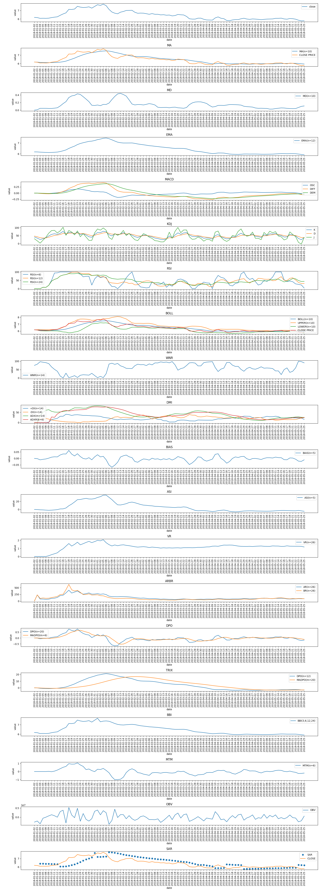

.. contents::
   :depth: 3.0
..

.. \_reference:

.. currentmodule:: tushare

.. highlightlang:: python

投资参考数据
============

*投资参考*\ 提供一些可能会影响股票价格走势的信息数据，为投资者在做投资决策时提供数据参考，亦可作为量化策略模型的事件因子纳入模型的计算。TuShare提供的参考数据主要包括以下：

-  分配预案
-  业绩预告
-  限售股解禁
-  基金持股
-  新股上市
-  融资融券（沪市）
-  融资融券（深市）

分配预案
--------

每到季报、年报公布的时段，就经常会有上市公司利润分配预案发布，而一些高送转高分红的股票往往会成为市场炒作的热点。及时获取和统计高送转预案的股票是参与热点炒作的关键，TuShare提供了简洁的接口，能返回股票的送转和分红预案情况。

参数说明：

-  **year** : 预案公布的年份，默认为2014
-  **top** :取最新n条数据，默认取最近公布的25条
-  **retry\_count**\ ：当网络异常后重试次数，默认为3
-  **pause**:重试时停顿秒数，默认为0

返回值说明：

-  **code**:股票代码
-  **name**:股票名称
-  **year**:分配年份
-  **report\_date**:公布日期
-  **divi**:分红金额（每10股）
-  **shares**:转增和送股数（每10股）

调用方法：

::

    import tushare as ts

    df = ts.profit_data(top=60)
    df.sort('shares',ascending=False)

结果显示：

::

        code    name    year    report_date  divi  shares
    59  002555  顺荣三七  2014  2015-03-31   1.0      17
    32  002269  美邦服饰  2014  2015-04-01   1.0      15
    24  600353  旭光股份  2014  2015-04-02   0.7      10
    27  002610  爱康科技  2014  2015-04-01   0.0      10
    51  300287   飞利信  2014  2015-03-31   0.7      10
    29  300168  万达信息  2014  2015-04-01   1.0      10
    25  002681  奋达科技  2014  2015-04-01   1.5       8
    31  300098   高新兴  2014  2015-04-01   0.5       6
    44  300354  东华测试  2014  2015-03-31   0.3       6
    8   300108  双龙股份  2014  2015-04-02   0.0       5
    10  002396  星网锐捷  2014  2015-04-02   1.0       5
    7   002686   亿利达  2014  2015-04-02   0.8       5
    40  600735   新华锦  2014  2015-04-01   0.0       5

选择每10股送转在10以上的：

::

    print df[df.shares>=10]

业绩预告
--------

按年度、季度获取业绩预告数据，接口提供从1998年以后每年的业绩预告数据，需指定年度、季度两个参数。数据在获取的过程中，会打印进度信息(下同)。

参数说明：

-  **year**:int 年度 e.g:2014
-  **quarter**:int 季度 :1、2、3、4，只能输入这4个季度

结果返回的数据属性说明如下：

::

    code,代码
    name,名称
    type,业绩变动类型【预增、预亏等】
    report_date,发布日期
    pre_eps,上年同期每股收益
    range,业绩变动范围

调用方法：

::

    #获取2014年中报的业绩预告数据
    ts.forecast_data(2014,2)

结果返回：

::

          code      name     type report_date  pre_eps             range
    0     000710   天兴仪表   预亏  2014-08-27  -0.0178                --
    1     600710   常林股份   减亏  2014-08-23    -0.12                --
    2     002071   长城影视   预升  2014-08-21   0.0032              6.72
    3     000555   神州信息   预升  2014-08-21  -0.0494              36.7
    4     600007   中国国贸   预升  2014-08-20     0.23             23.21
    5     002125   湘潭电化   预亏  2014-08-19  -0.1721                --
    6     300153   科泰电源   预升  2014-08-18     0.07             20.02
    7     601668   中国建筑   --   2014-08-15     0.29               30%
    8     600754   锦江股份   预升  2014-08-15   0.2786             10.83
    9     002491   通鼎互联   预升  2014-08-14   0.3817              2.22
    10    601177   杭齿前进   预升  2014-08-12   0.0373             37.43

限售股解禁
----------

以月的形式返回限售股解禁情况，通过了解解禁股本的大小，判断股票上行的压力。可通过设定年份和月份参数获取不同时段的数据。

参数说明：

-  **year**:年份,默认为当前年
-  **month**:解禁月份，默认为当前月
-  **retry\_count**\ ：当网络异常后重试次数，默认为3
-  **pause**:重试时停顿秒数，默认为0

返回值说明：

-  **code**\ ：股票代码
-  **name**\ ：股票名称
-  **date**:解禁日期
-  **count**:解禁数量（万股）
-  **ratio**:占总盘比率

调用方法：

::

    import tushare as ts

    ts.xsg_data()

结果显示：

::

        code     name        date       count   ratio
    0   000100  TCL集团  2015-04-30    79277.10   6.50
    1   000859   国风塑业  2015-04-30    14832.75  26.08
    2   002526   山东矿机  2015-04-30    15797.95  29.58
    3   300026   红日药业  2015-04-30       55.50   0.09
    4   300272   开能环保  2015-04-30       14.62   0.06
    5   002137    实益达  2015-04-29       65.70   0.14
    6   600172   黄河旋风  2015-04-28      777.62   1.12
    7   000955   欣龙控股  2015-04-27     3900.00   7.24
    8   603000    人民网  2015-04-27    32980.00  59.66
    9   002521   齐峰新材  2015-04-26      244.20   0.58
    10  300195   长荣股份  2015-04-26       66.60   0.39

基金持股
--------

获取每个季度基金持有上市公司股票的数据。

参数说明：

-  **year**:年份,默认为当前年
-  **quarter**:季度（只能输入1，2，3，4这个四个数字）
-  **retry\_count**\ ：当网络异常后重试次数，默认为3
-  **pause**:重试时停顿秒数，默认为0

返回值说明：

-  **code**\ ：股票代码
-  **name**\ ：股票名称
-  **date**:报告日期
-  **nums**:基金家数
-  **nlast**:与上期相比（增加或减少了）
-  **count**:基金持股数（万股）
-  **clast**:与上期相比
-  **amount**:基金持股市值
-  **ratio**:占流通盘比率

调用方法：

::

    import tushare as ts

    ts.fund_holdings(2014, 4)

结果显示：

::

            code   name        date     nums nlast      count      clast      amount  \
    0     603993   洛阳钼业  2014-12-31  108   106    4546.12    4486.11    39778.53   
    1     603806    福斯特  2014-12-31    3    -5      12.10     -33.07      461.95   
    2     603766   隆鑫通用  2014-12-31   65    50    2469.13   -1529.92    33185.16   
    3     603606   东方电缆  2014-12-31   16     0     113.22      81.83     2493.21   
    4     603456   九洲药业  2014-12-31   18     8    1508.28    1441.44    49230.23   
    5     603366   日出东方  2014-12-31   68    66    1771.41    1509.48    28750.06   
    6     603328   依顿电子  2014-12-31   43    42      91.78      51.01     2137.60   
    7     603308   应流股份  2014-12-31   10     8     288.30     288.10     5166.26   
    8     603306   华懋科技  2014-12-31    1    -9       3.41     -47.75       86.38   
    9     603288   海天味业  2014-12-31  135   128    2746.63    2285.18   109727.72   
    10    603169   兰石重装  2014-12-31    1   -12       0.10      -9.80        1.76   

新股数据
--------

获取IPO发行和上市的时间列表，包括发行数量、网上发行数量、发行价格已经中签率信息等。

参数说明：

-  **retry\_count**\ ：当网络异常后重试次数，默认为3
-  **pause**:重试时停顿秒数，默认为0

返回值说明：

-  **code**\ ：股票代码
-  **name**\ ：股票名称
-  **ipo\_date**:上网发行日期
-  **issue\_date**:上市日期
-  **amount**:发行数量(万股)
-  **markets**:上网发行数量(万股)
-  **price**:发行价格(元)
-  **pe**:发行市盈率
-  **limit**:个人申购上限(万股)
-  **funds**\ ：募集资金(亿元)
-  **ballot**:网上中签率(%)

调用方法：

::

    import tushare as ts

    ts.new_stocks()

结果显示：

::

          code   name    ipo_date     issue_date  amount  markets  price     pe  limit  \
    0    300442   普丽盛 2015-04-16        NaT    2500     1000   0.00   0.00   0.00   
    1    300434  金石东方 2015-04-16        NaT    1700      680   0.00   0.00   0.00   
    2    300438  鹏辉能源 2015-04-16        NaT    2100      840   0.00   0.00   0.00   
    3    002751  易尚展示 2015-04-16        NaT    1756      696   0.00   0.00   0.00   
    4    300404  博济医药 2015-04-16        NaT    1667      657   0.00   0.00   0.00   
    5    603021  山东华鹏 2015-04-15        NaT    2640     1040   0.00   0.00   0.00   
    6    300441  鲍斯股份 2015-04-15        NaT    2112      845   0.00   0.00   0.00   
    7    603315  福鞍股份 2015-04-15        NaT    2500     1000   0.00   0.00   0.00   
    8    600959  江苏有线 2015-04-15        NaT   59700    17700   0.00   0.00   0.00   
    9    300448  浩云科技 2015-04-15        NaT    2000      800   0.00   0.00   0.00   
    10   300440  运达科技 2015-04-15        NaT    2800     1120   0.00   0.00   0.00   

融资融券（沪市）
----------------

沪市的融资融券数据从上海证券交易所网站直接获取，提供了有记录以来的全部汇总和明细数据。根据上交所网站提示：数据根据券商申报的数据汇总，由券商保证数据的真实、完整、准确。

-  本日融资融券余额＝本日融资余额＋本日融券余量金额
-  本日融资余额＝前日融资余额＋本日融资买入额－本日融资偿还额；
-  本日融资偿还额＝本日直接还款额＋本日卖券还款额＋本日融资强制平仓额＋本日融资正权益调整－本日融资负权益调整；
-  本日融券余量=前日融券余量+本日融券卖出数量-本日融券偿还量；
-  本日融券偿还量＝本日买券还券量＋本日直接还券量＋本日融券强制平仓量＋本日融券正权益调整－本日融券负权益调整－本日余券应划转量；
-  融券单位：股（标的证券为股票）/份（标的证券为基金）/手（标的证券为债券）。
-  明细信息中仅包含当前融资融券标的证券的相关数据，汇总信息中包含被调出标的证券范围的证券的余额余量相关数据。

**沪市融资融券汇总数据**

参数说明：

-  **start**:开始日期 format：YYYY-MM-DD 为空时取去年今日
-  **end**:结束日期 format：YYYY-MM-DD 为空时取当前日期
-  **retry\_count**\ ：当网络异常后重试次数，默认为3
-  **pause**:重试时停顿秒数，默认为0

返回值说明：

-  **opDate**:信用交易日期
-  **rzye**:本日融资余额(元)
-  **rzmre**: 本日融资买入额(元)
-  **rqyl**: 本日融券余量
-  **rqylje**: 本日融券余量金额(元)
-  **rqmcl**: 本日融券卖出量
-  **rzrqjyzl**:本日融资融券余额(元)

调用方法：

::

    import tushare as ts

    ts.sh_margins(start='2015-01-01', end='2015-04-19')

结果显示：

::

        opDate           rzye         rzmre       rqyl      rqylje  \
    0   2015-04-17  1149157713135  129211438621  819750253  6041055352   
    1   2015-04-16  1157182044282  112006268973  820992013  5973347250   
    2   2015-04-15  1146127306376  127637503244  815236850  5760511452   
    3   2015-04-14  1132444514795  135681414792  808065982  5734278801   
    4   2015-04-13  1112644681454  125462079457  837423227  6012263982   
    5   2015-04-10  1093646777627  120171575492  851628036  6013790547   
    6   2015-04-09  1080032082669  151266260607  950252465  7459280657   
    7   2015-04-08  1063907515309  146795417745  883306430  6090844298   
    8   2015-04-07  1049019510305  135205459177  890246879  6052607373   
    9   2015-04-03  1028339497560  121745692024  833666811  5639393066   

         rqmcl       rzrqjyzl  
    0   1380227173  1155198768487  
    1   2203963301  1163155391532  
    2   2243634120  1151887817828  
    3   2105259947  1138178793596  
    4   1717712021  1118656945436  
    5   1903813388  1099660568174  
    6   1839296323  1087491363326  
    7   1811107279  1069998359607  
    8   1812376621  1055072117678  
    9   1685019881  1033978890626  

**沪市融资融券明细数据**

参数说明：

-  **date**:日期 format：YYYY-MM-DD
   默认为空'',数据返回最近交易日明细数据
-  **symbol**\ ：标的代码，6位数字e.g.600848，默认为空''
-  **start**:开始日期 format：YYYY-MM-DD 默认为空''
-  **end**:结束日期 format：YYYY-MM-DD 默认为空''
-  **retry\_count**\ ：当网络异常后重试次数，默认为3
-  **pause**:重试时停顿秒数，默认为0

返回值说明：

-  **opDate**:信用交易日期
-  **stockCode**:标的证券代码
-  **securityAbbr**:标的证券简称
-  **rzye**:本日融资余额(元)
-  **rzmre**: 本日融资买入额(元)
-  **rzche**:本日融资偿还额(元)
-  **rqyl**: 本日融券余量
-  **rqmcl**: 本日融券卖出量
-  **rqchl**: 本日融券偿还量

调用方法：

::

    import tushare as ts

    ts.sh_margin_details(start='2015-01-01', end='2015-04-19', symbol='601989')
    #如果不设symbol参数或者开始和结束日期时段设置过长，数据获取可能会比较慢，建议分段分步获取，比如一年为一个周期

结果显示：

::

        opDate      stockCode       securityAbbr   rzye       rzmre       rzche  \
    0   2015-04-17    601989         中国重工  14252656894  2312839368  2601765162   
    1   2015-04-16    601989         中国重工  14554040816  2548138684  2829229670   
    2   2015-04-15    601989         中国重工  14835131802  2107531845  1748705388   
    3   2015-04-14    601989         中国重工  14476305345  3032554867  2310655239   
    4   2015-04-13    601989         中国重工  13789855569  1479008826  1205637113   
    5   2015-04-10    601989         中国重工  13516483857  1168986102  1196101729   
    6   2015-04-09    601989         中国重工  13543599484  1474071547  1503903339   
    7   2015-04-08    601989         中国重工  13599709125  1567850413  1489255328   
    8   2015-04-07    601989         中国重工  13514051054  1709141749  1614928278   
    9   2015-04-03    601989         中国重工  13411176185  2033773020  1634094504   

        rqyl      rqmcl      rqchl  
    0   2070747   18772355   18677978  
    1   1976370  107495699  106518076  
    2    998747   71400666   71855619  
    3   1453700  107761665  107808218  
    4   1482253   45963069   46086007  
    5   1605191   60792818   61117727  
    6   1930100   38205439   37598326  
    7   1237814   50049257   50097957  
    8   1286514   73136275   73024138  
    9   1174377  103765174  103718451  

融资融券（深市）
----------------

深市的融资融券数据从深圳证券交易所网站直接获取，提供了有记录以来的全部汇总和明细数据。在深交所的网站上，对于融资融券的说明如下：

说明：

本报表基于证券公司报送的融资融券余额数据汇总生成，其中：

::

    本日融资余额(元)=前日融资余额＋本日融资买入-本日融资偿还额
    本日融券余量(股)=前日融券余量＋本日融券卖出量-本日融券买入量-本日现券偿还量
    本日融券余额(元)=本日融券余量×本日收盘价
    本日融资融券余额(元)=本日融资余额＋本日融券余额；

2014年9月22日起，“融资融券交易总量”数据包含调出标的证券名单的证券的融资融券余额。

**深市融资融券汇总数据**

参数说明：

-  **start**:开始日期 format：YYYY-MM-DD 为空时取去年今日
-  **end**:结束日期 format：YYYY-MM-DD 为空时取当前日期
-  **retry\_count**\ ：当网络异常后重试次数，默认为3
-  **pause**:重试时停顿秒数，默认为0

返回值说明：

-  **opDate**:信用交易日期(index)
-  **rzmre**: 融资买入额(元)
-  **rzye**:融资余额(元)
-  **rqmcl**: 融券卖出量
-  **rqyl**: 融券余量
-  **rqye**: 融券余量(元)
-  **rzrqye**:融资融券余额(元)

调用方法：

::

    import tushare as ts

    ts.sz_margins(start='2015-01-01', end='2015-04-19')

结果显示：

::

                rzmre          rzye      rqmcl       rqyl        rqye  \
    opDate                                                                    
    2015-01-05  38277263968  329575457077  290786402  328745900  2217097425   
    2015-01-06  37065808766  330337451354  234959735  336234242  2275278509   
    2015-01-07  30805638905  333570682580  204113638  342875246  2340163403   
    2015-01-08  28316028226  334537113612  209058725  324338597  2248088027   
    2015-01-09  29236879032  334096183516  261141219  300986514  2076584482   
    2015-01-12  24331316036  336071465357  234181290  286924013  1985929255   
    2015-01-13  22634216323  337225655535  246749378  284409172  1968502622   
    2015-01-14  23342662784  341201284890  225359998  275175916  1885368528   
    2015-01-15  23670699950  343792509454  250484696  286478745  1960122114   
    2015-01-16  29221750218  344702543733  231980680  299066189  2021372924     

                      rzrqye  
    opDate                    
    2015-01-05  331792554502  
    2015-01-06  332612729863  
    2015-01-07  335910845983  
    2015-01-08  336785201639  
    2015-01-09  336172767998  
    2015-01-12  338057394612  
    2015-01-13  339194158157  
    2015-01-14  343086653418  
    2015-01-15  345752631568  
    2015-01-16  346723916657 

**深市融资融券明细数据**

参数说明：

-  **date**:日期 format：YYYY-MM-DD
   默认为空'',数据返回最近交易日明细数据
-  **retry\_count**\ ：当网络异常后重试次数，默认为3
-  **pause**:重试时停顿秒数，默认为0

返回值说明：

-  **stockCode**:标的证券代码
-  **securityAbbr**:标的证券简称
-  **rzmre**: 融资买入额(元)
-  **rzye**:融资余额(元)
-  **rqmcl**: 融券卖出量
-  **rqyl**: 融券余量
-  **rqye**: 融券余量(元)
-  **rzrqye**:融资融券余额(元)
-  **opDate**:信用交易日期

调用方法：

::

    import tushare as ts

    ts.sz_margin_details('2015-04-20')
    #深市融资融券明细一次只能获取一天的明细数据，如果不输入参数，则为最近一个交易日的明细数据

结果显示：

::

        stockCode securityAbbr       rzmre        rzye     rqmcl     rqyl      rqye  \
    0    000001         平安银行   914150095  5960345469   9598977  1898697  30948760   
    1    000002         万 科Ａ  1602572463  7422963456  14532967  2843656  40408351   
    2    000006         深振业Ａ   341727587  1566603285    252419    80590    866343   
    3    000009         中国宝安   520548152  4076646657    971086   533460   9543599   
    4    000012         南 玻Ａ           0   710082271         0   665743   7236626   
    5    000024         招商地产           0  2469445374         0   518556  16573050   
    6    000027         深圳能源   158004666  1156768901    780641   404882   5729080   
    7    000028         国药一致    71928528   499539059     26050    33934   2404223   
    8    000031         中粮地产   275150291  1382171682    813989   250644   2894938   
    9    000039         中集集团   505792033  2456145597   2514898   644534  17640896   

       rzrqye      opDate  
    0  5991294229  2015-04-20  
    1  7463371807  2015-04-20  
    2  1567469628  2015-04-20  
    3  4086190256  2015-04-20  
    4   717318897  2015-04-20  
    5  2486018424  2015-04-20  
    6  1162497981  2015-04-20  
    7   501943282  2015-04-20  
    8  1385066620  2015-04-20  
    9  2473786493  2015-04-20

常用股票技术指标
----------------
**概要**

用户可以调用tushare.get_k_data()获得的股票原始数据，再使用tushare.indictor中的方法计算出相应指标。
例如：计算“工商银行(601398)”自2018-01-01到2018-05-27收盘价的12日MA移动平均线指标

::

    import tushare as ts
    data = ts.get_k_data("601398", start="2018-01-01", end="2018-05-27")
    #数据按日期升序列排序
    data = data.sort_values(by=["date"], ascending=True)
    MA = ts.indictor.ma(data, n=12)
    data["ma"] = MA

显示结果：

::

            date  open  close  high   low     volume    code        ma
    0   2018-01-02  6.19   6.18  6.39  6.11  5374662.0  601398  6.180000
    1   2018-01-03  6.18   6.16  6.32  6.12  3493611.0  601398  6.170000
    2   2018-01-04  6.18   6.07  6.18  6.06  4351365.0  601398  6.136667
    3   2018-01-05  6.09   6.08  6.11  6.06  2817842.0  601398  6.122500
    4   2018-01-08  6.09   6.07  6.10  6.04  2184876.0  601398  6.112000
    5   2018-01-09  6.07   6.09  6.11  6.04  1671857.0  601398  6.108333
    6   2018-01-10  6.08   6.16  6.19  6.06  2487389.0  601398  6.115714
    7   2018-01-11  6.18   6.21  6.24  6.14  1970473.0  601398  6.127500
    8   2018-01-12  6.20   6.25  6.30  6.20  2188517.0  601398  6.141111

**注意事项**

如上面12日移动平均线的例子，当n取12时，前12日数据将不可信。对于大多数需要设置计算周期n的算法，前n项指标将不可信。
因此用户务必根据参数设定在输入数据前部留够余量。

**MA (Moving Average) 移动平均线指标**

指标资料：
`百度百科 <https://baike.baidu.com/item/MA指标/10230874?fr=aladdin>`__

参数说明：

-  **data**:通过tushare.get_k_data()获取的pandas.Dataframe数据
-  **n**：计算周期,默认为10
-  **val_name**: 需要计算的列名，默认为"close"收盘价

返回值说明：

-  **MA**:移动平均线数组

调用方法：

::

    import tushare as ts

    data = ts.get_k_data("601398")
    MA = ts.indictor.ma(data, n=10, val_name="close")
    MA

结果显示:

::

    array([4.332     , 4.2775    , 4.247     , 4.234     , 4.2282    ,
       4.22116667, 4.21228571, 4.2045    , 4.19344444, 4.1782    ,
       4.17481818, 4.17808333, 4.169     , 4.18033333, 4.18941667,
       4.1955    , 4.197     , 4.19625   , 4.20158333, 4.20916667,
       4.22125   , 4.23866667, 4.24625   , 4.247     , 4.24625   ,
    ...

**MD (Moving Deviation) 移动标准差**

指标资料：
`百度百科 <https://baike.baidu.com/item/%E5%B8%83%E6%9E%97%E7%BA%BF/3424486?fr=aladdin>`__

注:移动标准差是BOLL指标中数据，这里给出BOLL指标的资料

参数说明：

-  **data**:通过tushare.get_k_data()获取的pandas.Dataframe数据
-  **n**：计算周期,默认为10
-  **val_name**: 需要计算的列名，默认为"close"收盘价

返回值说明：

-  **MD**:移动平均线数组

调用方法：

::

    MD = ts.indictor.md(data, n=10, val_name="close")

结果显示:

略

**EMA (Exponential Moving Average) 指数平均数指标**

指标资料：
`百度百科 <https://baike.baidu.com/item/EMA/12646151>`__

参数说明：

-  **data**:通过tushare.get_k_data()获取的pandas.Dataframe数据
-  **n**：计算周期,默认为12
-  **val_name**: 需要计算的列名，默认为"close"收盘价

返回值说明：

-  **EMA**:指数平均数指标

调用方法：

::

    EMA = ts.indictor.ema(data, n=12, val_name="close")

**MACD (Moving Average Convergence / Divergence) 指数平滑移动平均线**

指标资料：
`百度百科 <https://baike.baidu.com/item/MACD%E6%8C%87%E6%A0%87?fromtitle=MACD&fromid=3334786>`__

参数说明：

-  **data**:通过tushare.get_k_data()获取的pandas.Dataframe数据
-  **quick_n**：DIFF差离值中快速移动天数,默认为12
-  **slow_n**：DIFF差离值中快速移动天数,默认为26
-  **dem_n**：DEM讯号线的移动天数,默认为9
-  **val_name**: 需要计算的列名，默认为"close"收盘价

返回值说明：

-  **OSC**: MACD bar / OSC 差值柱形图 值 = DIFF - DEM
-  **DIFF**: 差离值
-  **DEM**: 讯号线

调用方法：

::

    OSC, DIFF, DEM = ts.indictor.macd(data, quick_n=12, slow_n=26, dem_n=9, val_name="close")

**KDJ 随机指标**

指标资料：
`百度百科 <https://baike.baidu.com/item/KDJ%E6%8C%87%E6%A0%87?fromtitle=kdj&fromid=3423560>`__

参数说明：

-  **data**:通过tushare.get_k_data()获取的pandas.Dataframe数据

返回值说明：

-  **K**: K线
-  **D**: D线
-  **J**: J线

调用方法：

::

    K, D, J = ts.indictor.kdj(data, n=12, val_name="close")

**RSI (Relative Strength Index) 相对强弱指标**

指标资料：
`百度百科 <https://baike.baidu.com/item/EMA/12646151>`__

参数说明：

-  **data**:通过tushare.get_k_data()获取的pandas.Dataframe数据
-  **n**：计算周期,默认为6
-  **val_name**: 需要计算的列名，默认为"close"收盘价

返回值说明：

-  **RSI**:相对强弱指标

调用方法：

::

    RSI = ts.indictor.rsi(data, n=6, val_name="close")

**BOLL (Bollinger Bands) 布林线指标**

指标资料：
`百度百科 <https://baike.baidu.com/item/%E5%B8%83%E6%9E%97%E7%BA%BF%E6%8C%87%E6%A0%87/3325894>`__

参数说明：

-  **data**:通过tushare.get_k_data()获取的pandas.Dataframe数据
-  **n**：计算周期,默认为10
-  **val_name**: 需要计算的列名，默认为"close"收盘价
-  **k**: 中轨线到上轨线或下轨线的宽度等于标准差的倍数，默认为2

返回值说明：

-  **BOLL**:中轨线
-  **UPPER**:上轨线
-  **BOLL**:下轨线

调用方法：

::

    BOLL, UPPER, LOWER = ts.indictor.boll(data, n=10, val_name="close", k=2)

**W&R (Williams %R) 威廉指标**

指标资料：
`百度百科 <https://baike.baidu.com/item/W%26R>`__

参数说明：

-  **data**: 通过tushare.get_k_data()获取的pandas.Dataframe数据
-  **n**：计算周期,默认为14

返回值说明：

-  **WNR**:威廉指标

调用方法：

::

    WNR = ts.indictor.wnr(data, n=14)

**DMI (Directional Movement Index) 动向指标或趋向指标**

指标资料：
`百度百科 <https://baike.baidu.com/item/DMI%E6%8C%87%E6%A0%87/3423254?fromtitle=DMI&fromid=10910045>`__
`算法参考 <https://www.mk-mode.com/octopress/2012/03/03/03002038/>`__

参数说明：

-  **data**: 通过tushare.get_k_data()获取的pandas.Dataframe数据
-  **n**：DI统计时长，默认14
-  **m**：ADX统计时常参数，默认14
-  **k**：ADXR统计k个周期前数据，默认6

返回值说明：

-  **P_DI**:+DI指标
-  **M_DI**:-DI指标
-  **ADX**:ADX指标
-  **ADXR**:ADXR指标

调用方法：

::

    P_DI, M_DI, ADX, ADXR = ts.indictor.dmi(data, n=14, m=14, k=6)

**BIAS 乖离率**

指标资料：
`百度百科 <https://baike.baidu.com/item/DMI%E6%8C%87%E6%A0%87/3423254?fromtitle=DMI&fromid=10910045>`__
`算法参考 <https://www.mk-mode.com/octopress/2012/03/03/03002038/>`__

参数说明：

-  **data**: 通过tushare.get_k_data()获取的pandas.Dataframe数据
-  **n**：统计时长，默认5

返回值说明：

-  **BIAS**: 乖离率

调用方法：

::

    BIAS = ts.indictor.bias(data, n=5)

**ASI 震动升降指标**

指标资料：
`百度百科 <https://baike.baidu.com/item/ASI%E6%8C%87%E6%A0%87/6341775?fr=aladdin>`__

参数说明：

-  **data**: 通过tushare.get_k_data()获取的pandas.Dataframe数据
-  **n**：统计时长，默认5

返回值说明：

-  **ASI**: 震动升降指标

调用方法：

::

    ASI = ts.indictor.asi(data, n=5)

**VR (Volatility Volume Ratio) 成交量变异率**

指标资料：
`百度百科 <https://baike.baidu.com/item/VR%E6%8C%87%E6%A0%87/4672285>`__

参数说明：

-  **data**: 通过tushare.get_k_data()获取的pandas.Dataframe数据
-  **n**：统计时长，默认26

返回值说明：

-  **VR**: 成交量变异率

调用方法：

::

    VR = ts.indictor.vr(data, n=26)

**ARBR 指标**

指标资料：
`百度百科 <https://baike.baidu.com/item/arbr%E6%8C%87%E6%A0%87>`__

参数说明：

-  **data**: 通过tushare.get_k_data()获取的pandas.Dataframe数据
-  **n**：统计时长，默认26

返回值说明：

-  **AR**: AR指标
-  **BR**: BR指标

调用方法：

::

    VR = ts.indictor.arbr(data, n=26)

**DPO (Detrended Price Oscillator) 区间震荡线指标**

指标资料：
`百度百科 <https://baike.baidu.com/item/%E5%8C%BA%E9%97%B4%E9%9C%87%E8%8D%A1%E7%BA%BF?fromtitle=DPO%E6%8C%87%E6%A0%87&fromid=17502766>`__

参数说明：

-  **data**: 通过tushare.get_k_data()获取的pandas.Dataframe数据
-  **n**：统计时长，默认26
-  **m**：MADPO的参数M，默认6

返回值说明：

-  **DPO**: DPO指标
-  **MADPO**: MADPO指标

调用方法：

::

    DPO, MADPO = ts.indictor.dpo(data, n=20, m=6)

**TRIX (Triple Exponentially Smoothed Average) 三重指数平滑平均线**

指标资料：
`百度百科 <https://baike.baidu.com/item/TRIX%E6%8C%87%E6%A0%87>`__

参数说明：

-  **data**: 通过tushare.get_k_data()获取的pandas.Dataframe数据
-  **n**：统计时长，默认12
-  **m**：TRMA的参数M，默认20

返回值说明：

-  **TRIX**: TRIX指标
-  **TRMA**: TRMA指标

调用方法：

::

    TRIX, TRMA = ts.indictor.trix(data, n=12, m=20)

**BBI (Bull And Bearlndex) 多空指标**

指标资料：
`百度百科 <https://baike.baidu.com/item/BBI%E6%8C%87%E6%A0%87>`__

参数说明：

-  **data**: 通过tushare.get_k_data()获取的pandas.Dataframe数据

返回值说明：

-  **BBI**: 多空指标

调用方法：

::

    BBI = ts.indictor.bbi(data)

**MTM (Momentum Index) 动量指标**

指标资料：
`百度百科 <https://baike.baidu.com/item/MTM%E6%8C%87%E6%A0%87>`__

参数说明：

-  **data**: 通过tushare.get_k_data()获取的pandas.Dataframe数据
-  **n**: 统计时长，默认6

返回值说明：

-  **MTM**: 动量指标

调用方法：

::

    MTM = ts.indictor.mtm(data, n=6)

**OBV (On Balance Volume) 能量潮**

指标资料：
`百度百科 <https://baike.baidu.com/item/%E8%83%BD%E9%87%8F%E6%BD%AE?fromtitle=OBV%E6%8C%87%E6%A0%87&fromid=5114542>`__

参数说明：

-  **data**: 通过tushare.get_k_data()获取的pandas.Dataframe数据

返回值说明：

-  **OBV**: 能量潮

调用方法：

::

    OBV = ts.indictor.obv(data)

**SAR (Stop And Reverse) 抛物线指标**

指标资料：
`百度百科 <https://baike.baidu.com/item/%E8%83%BD%E9%87%8F%E6%BD%AE?fromtitle=OBV%E6%8C%87%E6%A0%87&fromid=5114542>`__
`算法参考 <https://virtualizedfrog.wordpress.com/2014/12/09/parabolic-sar-implementation-in-python/>`__

参数说明：

-  **data**: 通过tushare.get_k_data()获取的pandas.Dataframe数据
-  **init_af**: 动量因子初始值，默认0.02
-  **max_af**: 动量因子最大值，默认0.2

返回值说明：

-  **SAR**: 抛物线指标

调用方法：

::

    SAR = ts.indictor.sar(data, init_af=0.02, max_af=0.2)

**绘制全部指标图像**

参数说明：

-  **data**: 通过tushare.get_k_data()获取的pandas.Dataframe数据
-  **is_show**: 设置为True则绘图完成后直接显示
-  **output**: 图像输出路径，设置为None则不输出

调用方法：

::

    import tushare as ts
    data = ts.get_k_data("601398", start="2018-01-01", end="2018-05-27")
    data = data.sort_values(by=["date"], ascending=True)
    ts.indictor.plot_all(data, is_show=True, output=None)

结果显示：工商银行(601398)自2018-01-01到2018-05-27的全部指标数据绘图

